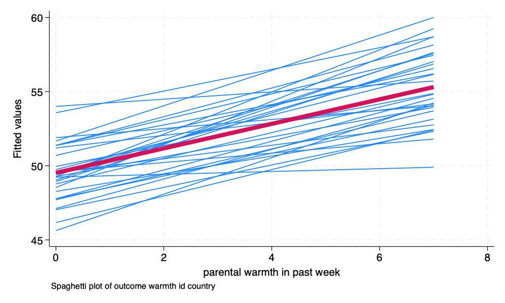
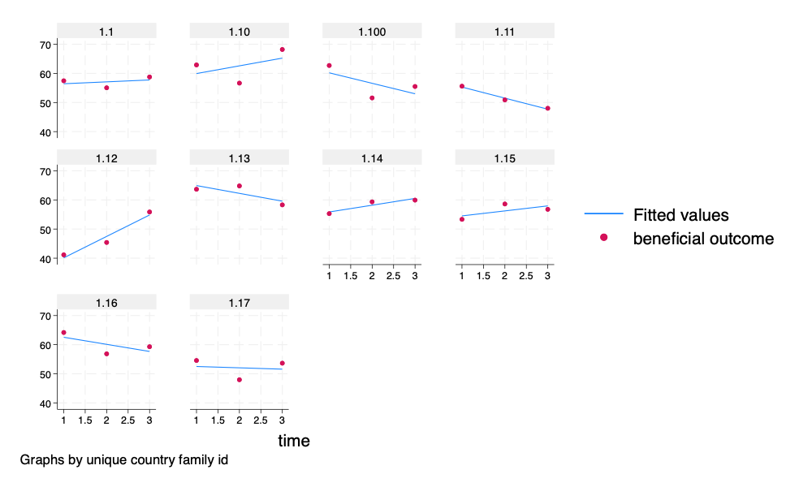

# Two Level Cross Sectional; And Three Level Longitudinal Models

```{r}
#| output: false
#| echo: false

library(Statamarkdown)

```

```{r}
#| echo: false
#| eval: true
#| output: false

file.copy("../multilevel-thinking/simulate-and-analyze-multilevel-data/simulated_multilevel_data.dta", 
          ".",
          overwrite = TRUE) # copy over most recent version

file.copy("../multilevel-thinking/simulate-and-analyze-multilevel-data/simulated_multilevel_longitudinal_data.dta", 
          ".",
          overwrite = TRUE) # copy over most recent version

```


```{stata, collectcode=TRUE, echo=FALSE}

clear all

quietly: cd "/Users/agrogan/Desktop/GitHub/multilevel-workshop/"

```

## Cross Sectional Model

### Get Data

::: {.panel-tabset group="language"}

#### Stata

```{stata, collectcode=TRUE}

set linesize 80 // set linesize for nice formatting

use "simulated_multilevel_data.dta", clear

```

#### R

```{r}

library(haven)

simulated_multilevel_data <- read_dta("simulated_multilevel_data.dta")

```

:::

### The Equation

$$\begin{aligned}
\text{outcome}_{ij} = \beta_0 + \beta_1 \text{parental warmth} + \beta_2 \text{physical punishment} + \\ \beta_3 \text{identity} + \beta_4 \text{intervention} + \beta_5 HDI + \\ u_{0j} + u_{1j} \times \text{parental warmth} + e_{ij} 
\end{aligned}$$ {#eq-crosssectional}

### Descriptive Statistics

::: {.panel-tabset group="language"}

#### Stata

```{stata}

summarize // descriptive statistics

```

#### R

```{r}
#| skimr_include_summary = FALSE

skimr::skim(simulated_multilevel_data)

```

:::

### Spaghetti Plot

::: {.panel-tabset group="language"}

#### Stata

```{stata}
*| output: false

spagplot outcome warmth, id(country) scheme(stcolor)

graph export spagplot1.png, width(1000) replace

```

{width=50%}
#### R

:::

::: {.callout-tip}
#### Random Slopes and Random Intercepts

This spaghetti plot is illustrating the idea of *random intercepts* and *random slopes*. The multilevel model is estimating *group specific regression lines*, in this case *country specific regression lines*. Each *country specific regression line* has its own intercept and its own slope. The results presented in the multilevel model are the result of *averaging* these estimates into one *overall estimate*. 
:::

### A Note On The Estimation of Random Effects

Procedures for estimating models with uncorrelated and correlated random effects are detailed below [@StataCorp2023; @JSSv067i01].

-------------------------------------------------------------
Software    Uncorrelated          Correlated
            Random                Random
            Effects               Effects
----------- --------------------- ---------------------------
Stata       default               add option: `, cov(uns)`

R           separate random       separate random 
            effects from          effects from
            grouping variable     grouping variable
            with `||`             with `|`
            
-------------------------------------------------------------

: Correlated and Uncorrelated Random Effects {#tbl-REs}

All models in the examples below are run with *uncorrelated* random effects, but could just as easily be run with *correlated* random effects. 

### Unconditional Model

#### Model

::: {.panel-tabset group="language"}

##### Stata

```{stata, collectcode=TRUE}

mixed outcome || country: // unconditional model

```

##### R

```{r}

library(lme4)

fit0 <- lmer(outcome ~  (1 | country),
             data = simulated_multilevel_data)

summary(fit0)

```

:::

#### ICC

::: {.panel-tabset group="language"}

##### Stata

```{stata}

estat icc

```

##### R

```{r}

library(performance) 

performance::icc(fit0) # ICC

```

:::	

### Conditional Model

::: {.panel-tabset group="language"}

#### Stata

```{stata, collectcode=TRUE}

mixed outcome warmth physical_punishment identity i.intervention HDI || country: warmth // multilevel model

est store crosssectional // store estimates

```

#### R

```{r}

library(lme4)

fit1 <- lmer(outcome ~ warmth + physical_punishment + 
               identity  + intervention + HDI + 
               (1 + warmth || country),
             data = simulated_multilevel_data)

summary(fit1)

```


:::

## Longitudinal Model

### Get Data

::: {.panel-tabset group="language"}

#### Stata

```{stata, collectcode=TRUE}

use "simulated_multilevel_longitudinal_data.dta", clear

```

#### R

:::

### The Equation

$$\begin{aligned}
\text{outcome}_{ij} = \beta_0 + \beta_1 \text{parental warmth} + \beta_2 \text{physical punishment} + \beta_3 \text{time} + \\
\beta_4 \text{identity}_2 + \beta_5 \text{intervention} + \beta_5 HDI + \\
u_{0j} + u_{1j} \times \text{parental warmth} + \\
v_{0i} + v_{1i} \times t + e_{ij} 
\end{aligned}$$ {#eq-longitudinal}

### Descriptive Statistics

::: {.panel-tabset group="language"}

#### Stata

```{stata, collectcode=TRUE}

summarize // descriptive statistics

```

#### R

:::

### Alternate Plot

::: {.panel-tabset group="language"}

#### Stata

```{stata, collectcode=FALSE}
*| output: false

encode id, generate(idNUMERIC) // numeric version of id
	
* spagplot outcome t if idNUMERIC <= 10, id(idNUMERIC) scheme(stcolor)
	
twoway (lfit outcome t) (scatter outcome t) if idNUMERIC <= 10, by(idNUMERIC) scheme(stcolor)

graph export spagplot2.png, width(1000) replace

```

{width=50%}
#### R

:::

### Unconditional Model

#### Model

::: {.panel-tabset group="language"}

##### Stata

```{stata, collectcode=TRUE}
*| eval: false

mixed outcome || country: || id: // unconditional model

```

##### R
:::

#### ICC

::: {.panel-tabset group="language"}

##### Stata

```{stata, collectcode=FALSE}

estat icc

```

##### R

:::
	
### Conditional Model	

::: {.panel-tabset group="language"}

#### Stata

```{stata, collectcode=TRUE}

mixed outcome t warmth physical_punishment i.identity i.intervention HDI || country: warmth || id: t // multilevel model

est store longitudinal // store estimates

```

#### R

:::

### Nice Table of Results

::: {.panel-tabset group="language"}

#### Stata

```{stata, collectcode=TRUE}

etable, estimates(crosssectional longitudinal) ///
showstars showstarsnote /// show stars and note
column(estimate) // column is modelname

```
####

:::

## QUESTIONS??? {#majorsection}


